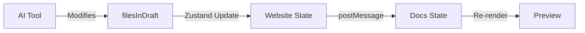
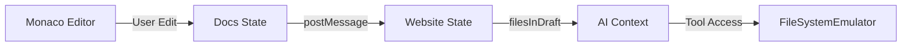
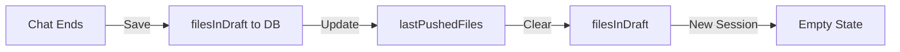

# State Management and Synchronization

Holocron uses Zustand for state management with a sophisticated iframe-based synchronization system to keep the editing interface and preview in sync.

## State Architecture

### Website State (Parent Frame)
Located in `website/src/lib/state.tsx`:
```typescript
export type State = {
    currentSlug: string                      // Current page being edited
    filesInDraft: Record<string, FileUpdate>  // In-memory file changes
    lastPushedFiles: Record<string, FileUpdate> // Last synced to GitHub
}
```

### Docs State (Preview Frame)
Located in `docs-website/src/lib/docs-state.tsx`:
```typescript
export type DocsState = {
    toc?: TOCItemType[]              // Table of contents
    currentSlug?: string             // Current page slug
    filesInDraft: FilesInDraft       // Same draft files
    isMarkdownStreaming?: boolean    // AI is generating content
    deletedPages: Array<{ slug: string }>
    previewMode?: 'preview' | 'editor'
    highlightedLines?: {             // Text selection from AI
        slug: string
        startLine: number
        endLine: number
    }
}

export type PersistentDocsState = {
    chatId: string                   // Current chat session
    drawerState: DrawerState         // UI drawer state
    chatHistory: Record<string, ChatHistory>  // Saved messages
}
```

## Zustand Store Setup

### Website Store
```typescript
export const [WebsiteStateProvider, useWebsiteState] = 
    createZustandContext<State>((initial) => 
        create((set) => ({ ...initial }))
    )

// Global access for debugging
if (typeof window !== 'undefined') {
    window['useWebsiteState'] = useWebsiteState
}
```

### Docs Store
```typescript
export const useDocsState = create<DocsState>(() => defaultState)

export const usePersistentDocsState = create<PersistentDocsState>(
    () => defaultPersistentState
)

// Global access
if (typeof window !== 'undefined') {
    window['useDocsState'] = useDocsState
}
```

## IFrame Communication

### Message Protocol
```typescript
export type IframeRpcMessage = {
    id: string                    // Unique message ID
    state?: Partial<DocsState>    // State updates to apply
    revalidate?: boolean          // Trigger re-render
    idempotenceKey?: string       // Deduplication key
    error?: string                // Error message
}
```

### Sending Updates (Docs → Website)
```typescript
export function updateFileInDocsEditor(githubPath: string, content: string) {
    const updatedFile = {
        content,
        githubPath,
    }
    
    // 1. Update local state
    useDocsState.setState((state) => ({
        ...state,
        filesInDraft: {
            ...state.filesInDraft,
            [githubPath]: updatedFile,
        },
    }))
    
    // 2. Send to parent frame
    if (typeof window !== 'undefined' && window.parent !== window) {
        const message: IframeRpcMessage = {
            id: generateChatId(),
            state: {
                filesInDraft: {
                    [githubPath]: updatedFile,
                },
            },
        }
        window.parent.postMessage(message, '*')
    }
}
```

### Receiving Updates (Website)
```typescript
// In website component
useEffect(() => {
    function handleMessage(event: MessageEvent) {
        const message = event.data as IframeRpcMessage
        
        if (message.state?.filesInDraft) {
            // Merge filesInDraft updates
            setState((prev) => ({
                ...prev,
                filesInDraft: {
                    ...prev.filesInDraft,
                    ...message.state.filesInDraft,
                },
            }))
        }
        
        if (message.revalidate) {
            // Trigger re-render or data refresh
            revalidateData()
        }
    }
    
    window.addEventListener('message', handleMessage)
    return () => window.removeEventListener('message', handleMessage)
}, [])
```

## State Flow Patterns

### 1. AI Tool → filesInDraft → Preview


### 2. Monaco Editor → filesInDraft → AI Context


### 3. Chat Completion → Database → Persistence


## Change Detection

### Checking for Unpushed Changes
```typescript
export function doFilesInDraftNeedPush(
    currentFilesInDraft: Record<string, FileUpdate>,
    lastPushedFiles: Record<string, FileUpdate>,
) {
    const hasNonPushedChanges = Object.keys(currentFilesInDraft).some((key) => {
        const current = currentFilesInDraft[key]
        const initial = lastPushedFiles[key]
        
        // Trim content for comparison (ignore whitespace)
        const currentContent = (current?.content ?? '').trim()
        const initialContent = (initial?.content ?? '').trim()
        
        const different = currentContent !== initialContent
        if (different) {
            const diffLen = Math.abs(
                currentContent.length - initialContent.length
            )
            console.log(
                `File "${key}" changed by ${diffLen} characters`
            )
        }
        return different
    })
    
    return hasNonPushedChanges
}
```

## Chat History Persistence

### Saving Chat Messages
```typescript
export function saveChatMessages(chatId: string, messages: UIMessage[]) {
    const state = usePersistentDocsState.getState()
    
    // Keep only last 10 messages per chat
    const limitedMessages = messages.slice(-10)
    
    const updatedHistory = {
        ...state.chatHistory,
        [chatId]: {
            messages: limitedMessages,
            createdAt: existingHistory?.createdAt || new Date().toISOString(),
        },
    }
    
    // Keep only 10 most recent chats total
    const sortedChats = Object.entries(updatedHistory)
        .sort(([, a], [, b]) => 
            new Date(b.createdAt).getTime() - 
            new Date(a.createdAt).getTime()
        )
        .slice(0, 10)
    
    usePersistentDocsState.setState({
        chatHistory: Object.fromEntries(sortedChats),
    })
}
```

### LocalStorage Persistence
```typescript
if (typeof window !== 'undefined') {
    const persistentStateKey = 'holocron-docs-persistent-state'
    
    // Rehydrate on load
    const savedState = localStorage.getItem(persistentStateKey)
    if (savedState) {
        try {
            const parsedState = JSON.parse(savedState)
            usePersistentDocsState.setState(parsedState)
        } catch (error) {
            console.warn('Failed to parse saved state:', error)
        }
    }
    
    // Persist on change
    usePersistentDocsState.subscribe((state) => {
        localStorage.setItem(persistentStateKey, JSON.stringify(state))
    })
}
```

## Real-time Updates

### Monaco Editor Integration
```typescript
// In Monaco component
const handleChange = (value: string) => {
    // Update local state and notify parent
    updateFileInDocsEditor(currentFile, value)
}

// Monaco configuration
<MonacoEditor
    value={filesInDraft[currentFile]?.content || originalContent}
    onChange={handleChange}
    language={getLanguageFromPath(currentFile)}
/>
```

### Preview Re-rendering
```typescript
// In preview component
const { filesInDraft } = useDocsState()

// Derive content from filesInDraft or database
const content = useMemo(() => {
    if (filesInDraft[currentPath]) {
        return filesInDraft[currentPath].content
    }
    return databaseContent
}, [filesInDraft, currentPath, databaseContent])

// Render markdown with draft content
<MarkdownRenderer content={content} />
```

## Text Highlighting

### Highlight State Management
```typescript
// Subscribe to highlight changes
useDocsState.subscribe((state, prevState) => {
    if (
        state.highlightedLines &&
        state.highlightedLines !== prevState.highlightedLines
    ) {
        highlightText(state.highlightedLines)
    }
})

// Apply highlighting
function highlightText({ slug, startLine, endLine }) {
    // Find elements and add highlight classes
    const elements = document.querySelectorAll(`[data-line]`)
    elements.forEach((el) => {
        const line = parseInt(el.dataset.line)
        if (line >= startLine && line <= endLine) {
            el.classList.add('highlight')
        }
    })
}
```

## State Update Patterns

### Optimistic Updates
```typescript
// Update UI immediately
setState({ filesInDraft: newFiles })

// Persist asynchronously
await saveToDatabase(newFiles).catch((error) => {
    // Rollback on error
    setState({ filesInDraft: oldFiles })
})
```

### Batch Updates
```typescript
// Collect multiple changes
const updates = {}
for (const file of files) {
    updates[file.path] = processFile(file)
}

// Single state update
setState((prev) => ({
    filesInDraft: {
        ...prev.filesInDraft,
        ...updates,
    },
}))
```

### Debounced Persistence
```typescript
const debouncedSave = useMemo(
    () => debounce(async (files) => {
        await prisma.chat.update({
            where: { chatId },
            data: { filesInDraft: files },
        })
    }, 1000),
    [chatId]
)

// On change
useEffect(() => {
    debouncedSave(filesInDraft)
}, [filesInDraft])
```

## Performance Considerations

### State Size Management
- Chat history limited to 10 messages per chat
- Maximum 10 chats stored in localStorage
- Large file content can impact performance

### Update Optimization
- Use partial state updates when possible
- Batch related changes together
- Debounce frequent updates

### Memory Management
- Clear filesInDraft after successful push
- Remove old chat history periodically
- Use lazy loading for large content

## Common Issues and Solutions

### State Desync
**Problem**: Preview doesn't match editor
**Solution**: Force revalidation via message:
```typescript
window.parent.postMessage({
    id: generateId(),
    revalidate: true,
}, '*')
```

### Lost Changes
**Problem**: Changes lost on refresh
**Solution**: Persist to database more frequently or use sessionStorage

### Performance Degradation
**Problem**: UI becomes sluggish with many files
**Solution**: Implement virtualization or pagination for file lists