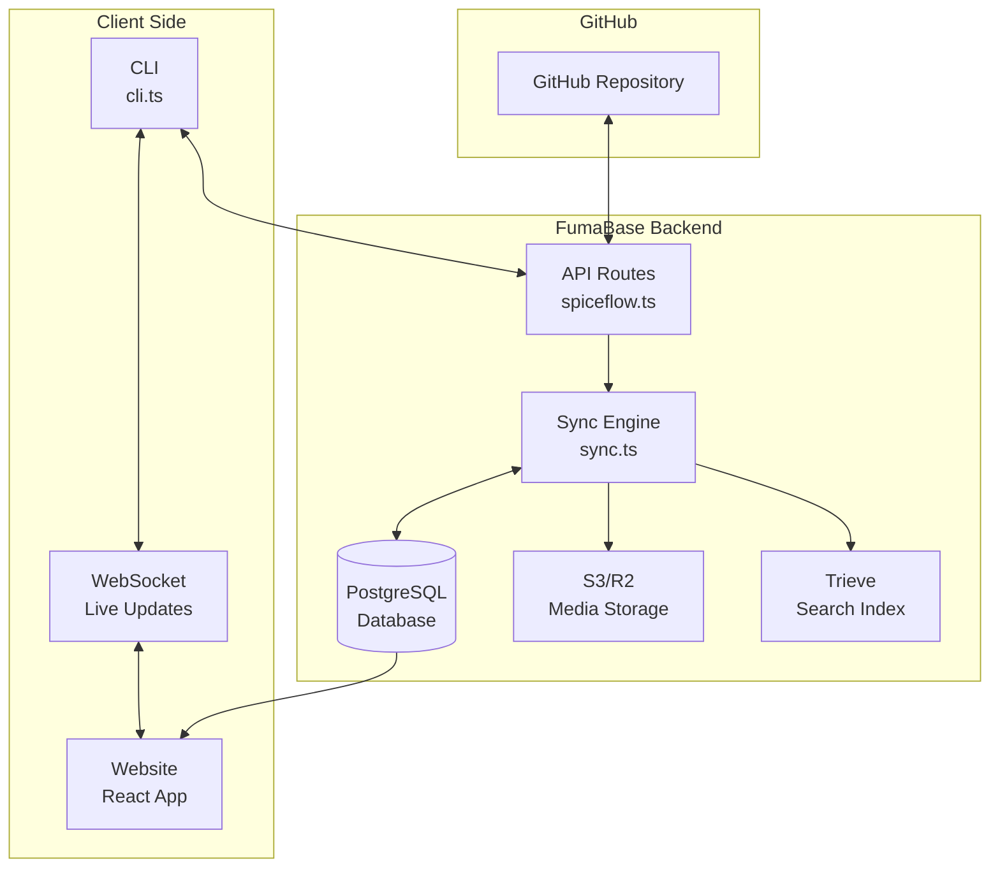
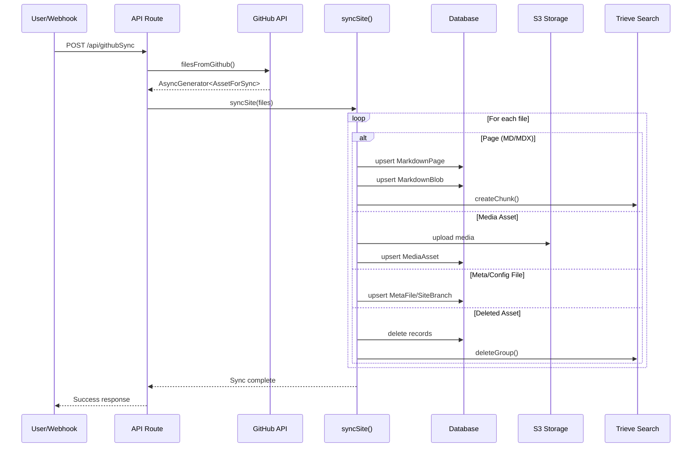
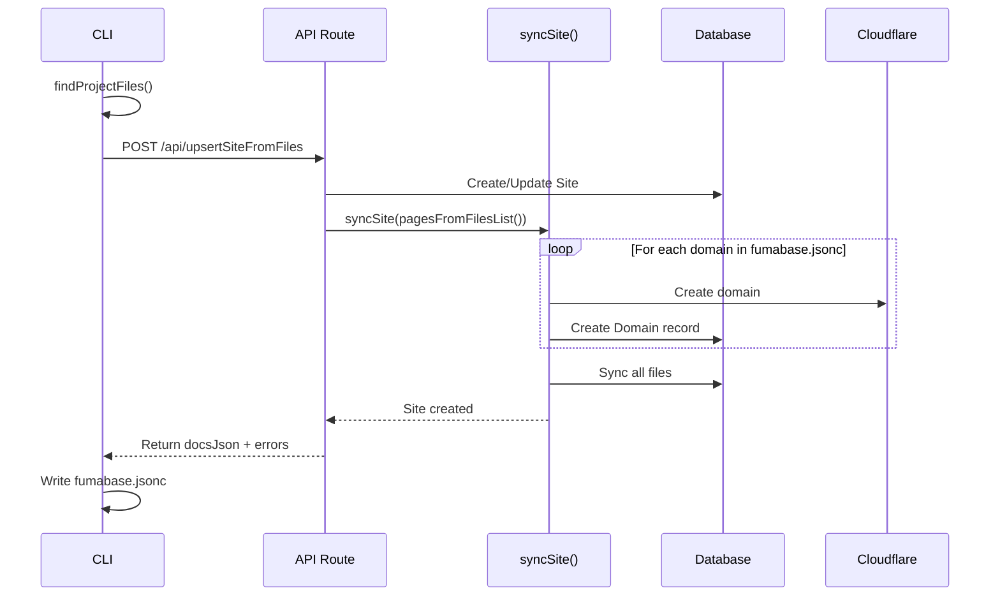
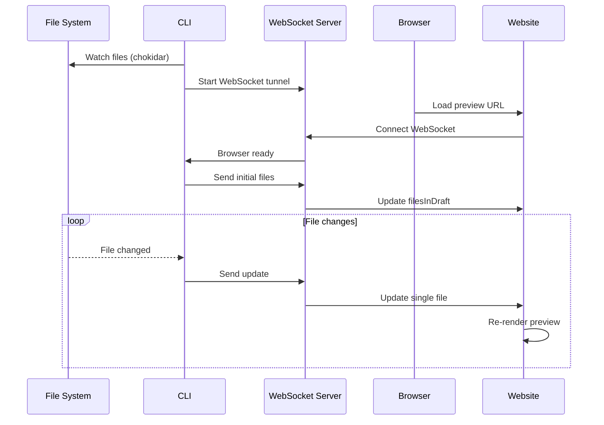
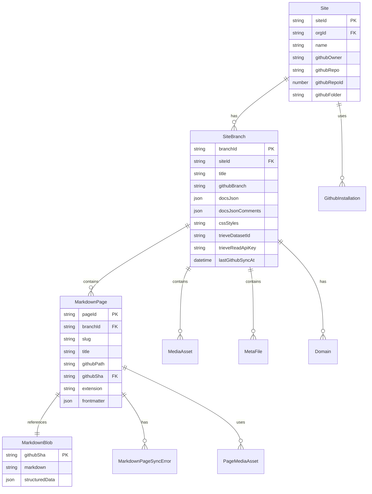

# FumaBase Sync Architecture

This document describes the synchronization flow between GitHub, the FumaBase database, the CLI, and the website.

## Overview

FumaBase uses a multi-directional sync system to keep documentation in sync between:
- GitHub repositories (source of truth)
- PostgreSQL database (cached content and metadata)
- CLI (local development)
- Live website (production/preview)

## High-Level Architecture



## Sync Flow Details

### 1. GitHub to Database Sync

This is the primary sync flow that imports content from GitHub into the database.



### 2. CLI to Database Sync (Initial Deploy)

Used when running `fumabase init` to create or update a site.



### 3. Local Development Flow (WebSocket)

Used during `fumabase dev` for live preview.



## Key Functions and Types

### Core Sync Functions

#### `syncSite()` (sync.ts:243-895)
Main orchestrator function that processes files and updates the database.

**Parameters:**
- `branchId`: Target branch ID
- `siteId`: Site ID
- `trieveDatasetId`: Optional search dataset ID
- `files`: AsyncIterable of AssetForSync
- `name`: Site name
- `githubFolder`: Base path in GitHub

**Process:**
1. Creates Trieve dataset if needed
2. Processes each file based on type
3. Updates database records
4. Syncs search index
5. Cleans up orphaned records

#### `filesFromGithub()` (sync.ts:929-1279)
Fetches files from GitHub repository.

**Parameters:**
- `repo`, `owner`: GitHub repository info
- `installationId`: GitHub App installation
- `branchId`: Database branch ID
- `basePath`: Folder within repo
- `onlyGithubPaths`: Optional filter
- `forceFullSync`: Skip SHA comparison

**Returns:** AsyncGenerator yielding AssetForSync items

#### `pagesFromFilesList()` (sync.ts:139-241)
Converts file list to processable assets.

**Parameters:**
- `files`: Array of file objects with content
- `githubFolder`: Base path
- `docsJson`: Optional docs configuration
- `docsJsonComments`: JSON-C comments

**Returns:** AsyncGenerator yielding AssetForSync items

### Core Types

#### `AssetForSync` (sync.ts:67-105)
Union type representing different syncable assets:

```typescript
type AssetForSync =
    | {
          type: 'page'
          totalPages: number
          markdown: string
          githubPath: string
          githubSha: string
      }
    | {
          type: 'mediaAsset'
          githubSha: string
          downloadUrl: string
          githubPath: string
          width?: number
          height?: number
          bytes?: number
      }
    | {
          type: 'metaFile'
          content: string
          githubPath: string
          githubSha: string
      }
    | {
          type: 'docsJson'
          content: string
          githubPath: string
          githubSha: string
      }
    | {
          type: 'stylesCss'
          content: string
          githubPath: string
          githubSha: string
      }
    | {
          type: 'deletedAsset'
          githubPath: string
      }
```

## Database Schema (Inferred)



## Recommendations for Improvements

### 1. Type Simplification

#### Current Issues:
- `AssetForSync` union type has 6 variants with overlapping properties
- Each variant has different required fields making it hard to work with
- The `filesFromGithub` and `pagesFromFilesList` generators yield mixed types

#### Recommendations:

**a) Create a base type with discriminated union:**
```typescript
interface BaseAsset {
  githubPath: string
  githubSha?: string
}

interface PageAsset extends BaseAsset {
  type: 'page'
  content: string
  totalPages: number
}

interface MediaAsset extends BaseAsset {
  type: 'media'
  downloadUrl?: string
  metadata?: {
    width?: number
    height?: number
    bytes?: number
  }
}

interface ConfigAsset extends BaseAsset {
  type: 'config' // Combines metaFile, docsJson, stylesCss
  configType: 'meta' | 'docsJson' | 'styles'
  content: string
}

interface DeletedAsset {
  type: 'deleted'
  githubPath: string
}

type AssetForSync = PageAsset | MediaAsset | ConfigAsset | DeletedAsset
```

**b) Separate file reading from asset creation:**
```typescript
interface RawFile {
  relativePath: string
  absolutePath?: string
  content?: string
  downloadUrl?: string
  sha?: string
  metadata?: FileMetadata
}

// Transform functions
function toAsset(file: RawFile, context: SyncContext): AssetForSync
```

### 2. Function Architecture Improvements

#### Current Issues:
- `syncSite` is 650+ lines with nested loops and conditionals
- File type detection is scattered across multiple functions
- Error handling is inconsistent
- Side effects (S3 upload, Trieve sync) mixed with data processing

#### Recommendations:

**a) Split syncSite into smaller functions:**
```typescript
class SyncOrchestrator {
  constructor(
    private db: PrismaClient,
    private storage: StorageService,
    private search: SearchService
  ) {}

  async sync(config: SyncConfig): Promise<SyncResult> {
    const processor = new AssetProcessor(config)
    const assets = processor.processFiles(config.files)
    
    const results = await this.processAssets(assets)
    await this.cleanupOrphaned(config, results)
    
    return this.compileSyncResult(results)
  }

  private async processAssets(assets: AsyncIterable<AssetForSync>) {
    const handlers = {
      page: this.syncPage.bind(this),
      media: this.syncMedia.bind(this),
      config: this.syncConfig.bind(this),
      deleted: this.deleteAsset.bind(this)
    }
    
    for await (const asset of assets) {
      await handlers[asset.type](asset)
    }
  }
}
```

**b) Separate concerns:**
```typescript
// File detection
class FileClassifier {
  static getFileType(path: string): FileType
  static isMarkdown(path: string): boolean
  static isMedia(path: string): boolean
}

// Asset transformation
class AssetTransformer {
  static fromGitHubFile(file: GitHubFile): AssetForSync
  static fromLocalFile(file: LocalFile): AssetForSync
}

// Storage operations
interface StorageService {
  uploadMedia(asset: MediaAsset): Promise<void>
  deleteMedia(slug: string): Promise<void>
}
```

### 3. Error Handling Improvements

#### Current Issues:
- Errors during sync can leave database in inconsistent state
- No rollback mechanism for failed syncs
- Limited error context for debugging

#### Recommendations:

**a) Implement transactional sync:**
```typescript
async function syncSiteTransactional(config: SyncConfig) {
  const syncId = generateSyncId()
  
  try {
    await db.$transaction(async (tx) => {
      // Record sync start
      await tx.syncLog.create({
        data: { syncId, status: 'started', config }
      })
      
      // Process all assets
      const results = await processAllAssets(tx, config)
      
      // Verify sync integrity
      await verifySyncIntegrity(tx, results)
      
      // Record sync success
      await tx.syncLog.update({
        where: { syncId },
        data: { status: 'completed', results }
      })
    })
  } catch (error) {
    await recordSyncError(syncId, error)
    throw new SyncError('Sync failed', { syncId, cause: error })
  }
}
```

**b) Add sync status tracking:**
```typescript
interface SyncStatus {
  syncId: string
  startedAt: Date
  completedAt?: Date
  status: 'pending' | 'processing' | 'completed' | 'failed'
  stats: {
    totalFiles: number
    processedFiles: number
    errors: SyncError[]
  }
}
```

### 4. Performance Optimizations

#### Current Issues:
- Sequential processing of assets
- Individual database queries for each file
- No caching of GitHub API responses

#### Recommendations:

**a) Batch database operations:**
```typescript
class BatchProcessor {
  private pagesBatch: MarkdownPage[] = []
  private mediaBatch: MediaAsset[] = []
  
  async addPage(page: MarkdownPage) {
    this.pagesBatch.push(page)
    if (this.pagesBatch.length >= 100) {
      await this.flushPages()
    }
  }
  
  async flushAll() {
    await Promise.all([
      this.flushPages(),
      this.flushMedia()
    ])
  }
}
```

**b) Parallel processing with concurrency control:**
```typescript
async function* processFilesInParallel(
  files: AsyncIterable<RawFile>,
  concurrency = 10
): AsyncGenerator<AssetForSync> {
  const semaphore = new Sema(concurrency)
  const queue = new PQueue({ concurrency })
  
  for await (const file of files) {
    queue.add(async () => {
      await semaphore.acquire()
      try {
        const asset = await processFile(file)
        return asset
      } finally {
        semaphore.release()
      }
    })
  }
  
  yield* queue.all()
}
```

### 5. API Design Improvements

#### Current Issues:
- Inconsistent API endpoints (some use camelCase, others use descriptive names)
- Mixed responsibilities in endpoints
- No API versioning

#### Recommendations:

**a) RESTful resource-based design:**
```typescript
// Instead of /githubSync, /upsertSiteFromFiles, etc.
app
  .route({
    method: 'POST',
    path: '/v1/sites/:siteId/sync',
    handler: syncFromGitHub
  })
  .route({
    method: 'PUT', 
    path: '/v1/sites/:siteId',
    handler: updateSite
  })
  .route({
    method: 'POST',
    path: '/v1/sites/:siteId/branches/:branchId/sync',
    handler: syncBranch
  })
```

**b) Consistent response format:**
```typescript
interface ApiResponse<T> {
  success: boolean
  data?: T
  error?: {
    code: string
    message: string
    details?: any
  }
  meta?: {
    version: string
    timestamp: string
    requestId: string
  }
}
```

### 6. Testing Improvements

#### Recommendations:

**a) Add integration tests for sync flows:**
```typescript
describe('GitHub Sync', () => {
  it('should sync new files from GitHub', async () => {
    const mockFiles = createMockGitHubFiles()
    const result = await syncSite({
      files: mockFiles,
      siteId: 'test-site',
      branchId: 'test-branch'
    })
    
    expect(result.processed).toBe(mockFiles.length)
    expect(result.errors).toHaveLength(0)
  })
  
  it('should handle sync failures gracefully', async () => {
    // Test with files that will cause errors
  })
})
```

**b) Add sync verification tools:**
```typescript
class SyncVerifier {
  async verify(siteId: string, branchId: string): Promise<VerificationResult> {
    const github = await this.getGitHubState(siteId)
    const database = await this.getDatabaseState(branchId)
    
    return {
      filesMatch: this.compareFiles(github, database),
      missingInDb: github.filter(f => !database.has(f)),
      extraInDb: database.filter(f => !github.has(f)),
      contentMismatches: this.compareContent(github, database)
    }
  }
}
```

## Summary

The current sync architecture works but could benefit from:
1. **Simpler types** with better separation of concerns
2. **Modular functions** that are easier to test and maintain
3. **Better error handling** with transactional guarantees
4. **Performance optimizations** through batching and parallelization
5. **Cleaner API design** following REST principles
6. **Comprehensive testing** to ensure sync reliability

These improvements would make the codebase more maintainable and reduce the risk of sync-related bugs.

<function_calls>
<invoke name="TodoWrite">
<parameter name="todos">[{"id": "1", "content": "Create sync flow documentation with diagrams", "status": "completed", "priority": "high"}, {"id": "2", "content": "Document all sync functions and their interactions", "status": "completed", "priority": "high"}, {"id": "3", "content": "Provide recommendations for type and function improvements", "status": "in_progress", "priority": "medium"}]