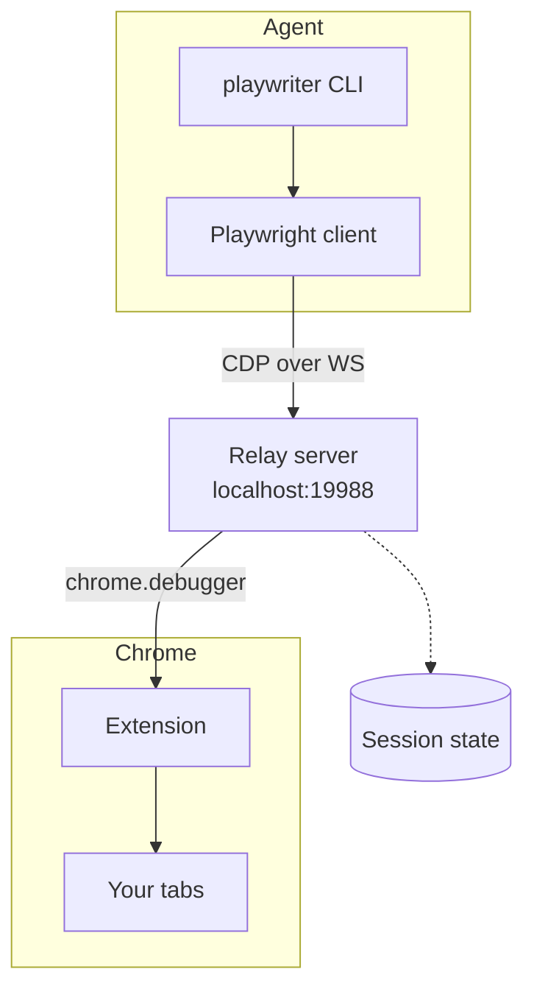
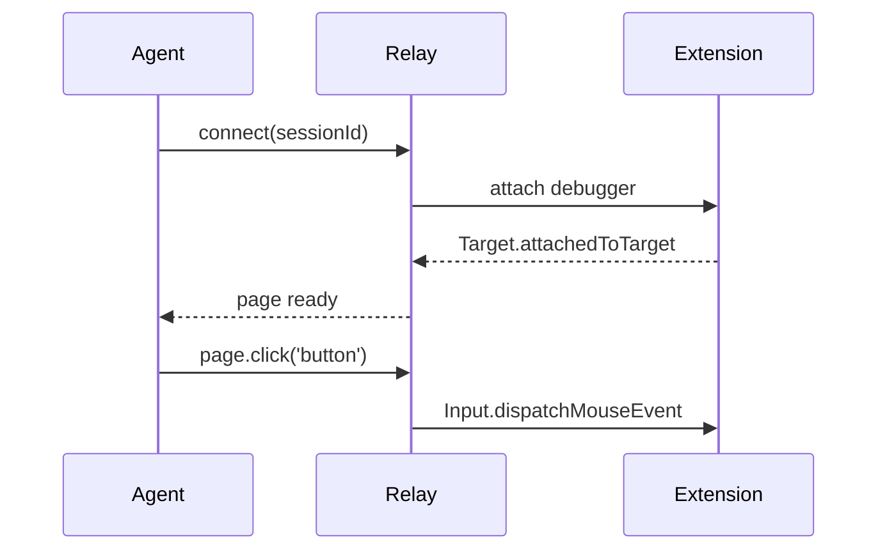
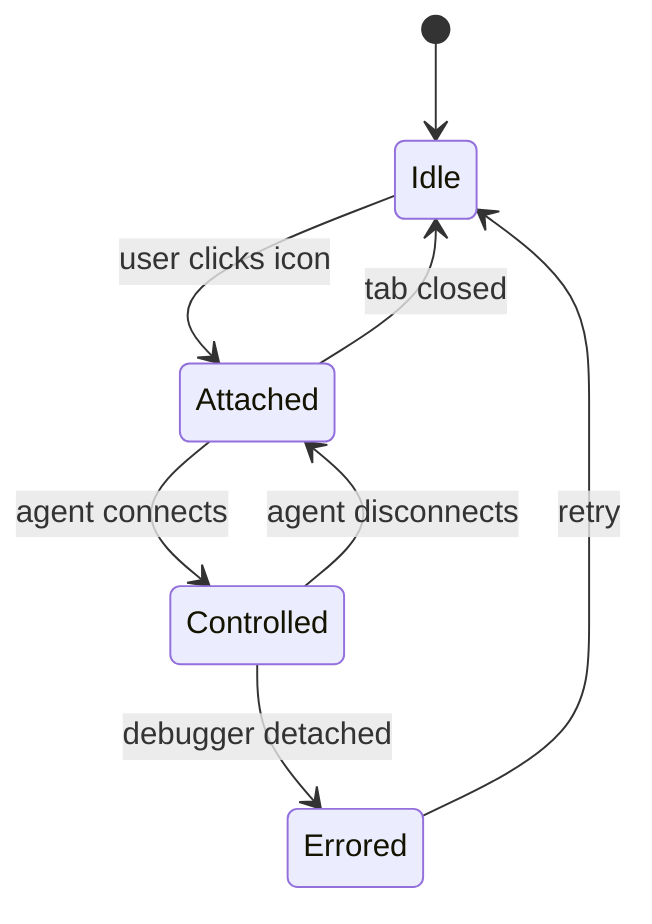
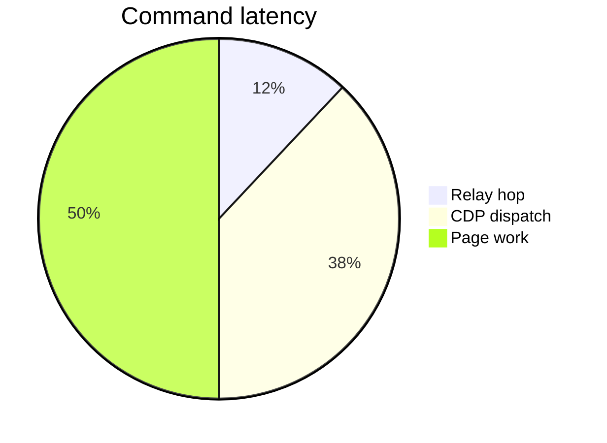

Playwriter connects your agent to the Chrome you already use. The extension relays CDP commands over a local WebSocket server.

```mermaid
flowchart TB
  subgraph agent[Agent]
    direction LR
    cli[playwriter CLI]:::blue --> sdk[Playwright client]:::blue
  end
  relay[Relay server<br/>localhost:19988]:::purple
  subgraph chrome[Chrome]
    direction LR
    ext[Extension]:::green --> tab[Your tabs]:::green
  end
  store[(Session state)]:::amber
  sdk -->|CDP over WS| relay
  relay -->|chrome.debugger| ext
  relay -.-> store
```

## Session lifecycle

```mermaid
sequenceDiagram
  participant Agent
  participant Relay
  participant Extension
  Agent->>Relay: connect(sessionId)
  Relay->>Extension: attach debugger
  Extension-->>Relay: Target.attachedToTarget
  Relay-->>Agent: page ready
  Agent->>Relay: page.click('button')
  Relay->>Extension: Input.dispatchMouseEvent
```

## Tab states

```mermaid actions={true} placement="top-right"
stateDiagram-v2
  [*] --> Idle
  Idle --> Attached: user clicks icon
  Attached --> Controlled: agent connects
  Controlled --> Attached: agent disconnects
  Attached --> Idle: tab closed
  Controlled --> Errored: debugger detached
  Errored --> Idle: retry
```

## Where time goes

```mermaid
pie title Command latency
  "Relay hop" : 12
  "CDP dispatch" : 38
  "Page work" : 50
```
