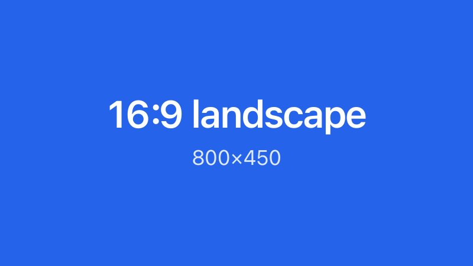
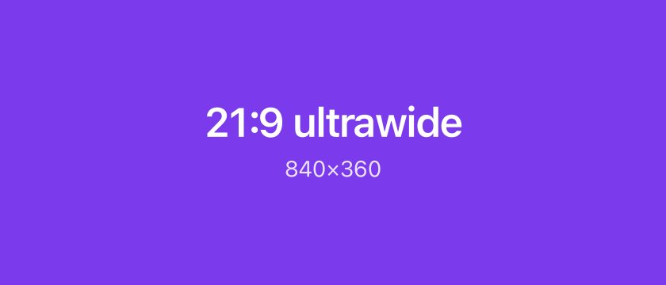
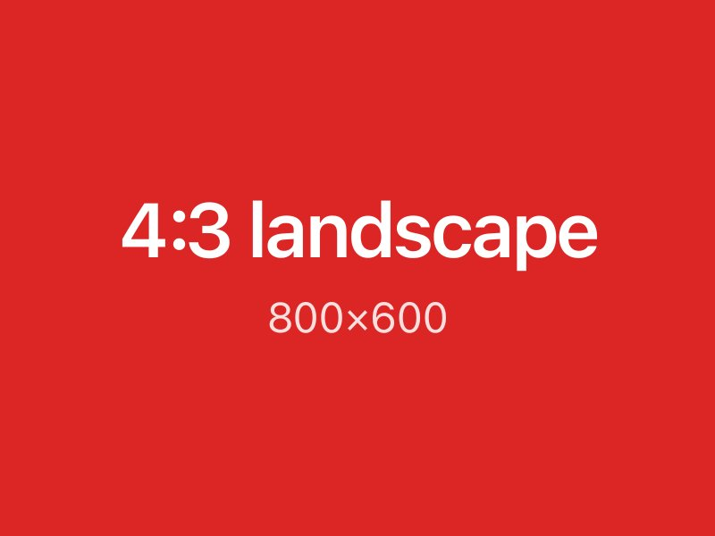
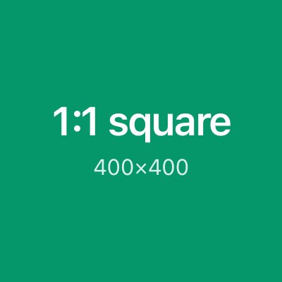
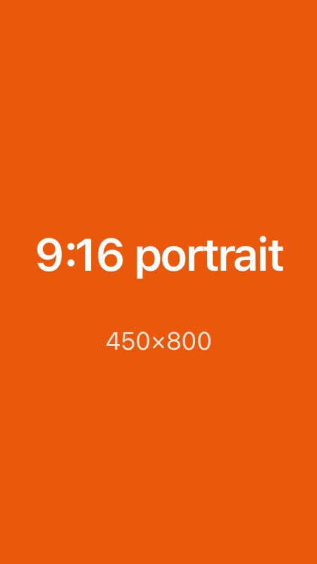
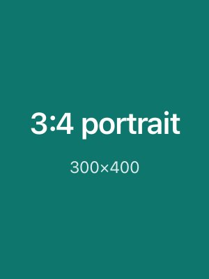
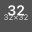
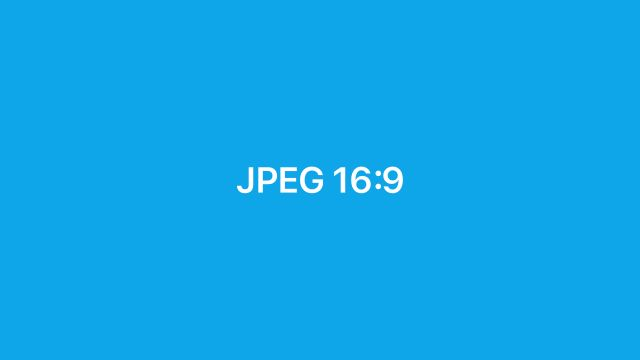
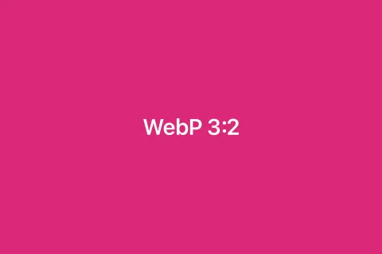
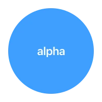

Kitchen-sink page for **image rendering**. Each block is a real MDX pattern a user would write. Look for layout shift, overflow, zoom, placeholders, and wrapper clipping.

```diagram
  MDX source                     Build                           Render
    ──────>   process + copy  ──────>         Image + placeholder
    ──────>   process, keep URL ────>         Image + placeholder
      ──────>   skip metadata  ───────>         raw img, no size
   ─────>   fetch + metadata ─────>         Image + placeholder
```

<Aside>
<Tip>
Local files next to this page live in `src/images/`. Public files use `/screenshot@2x.png` and `/images/…`. Remote URLs use Unsplash.
</Tip>
</Aside>

## Local relative files

Markdown image syntax with a **relative path**. These files sit next to the page and get copied to `/_holocron/images/`.

### 16:9 landscape



### 21:9 ultrawide



### 4:3 landscape



### 1:1 square



### 9:16 portrait



### 3:4 portrait



### 4:1 banner


### Tiny 32×32



### JPEG



### WebP



### SVG


### Transparent WebP

Page background should show through the **alpha** around the circle.



## Public directory

Same markdown syntax, but the file already lives in `public/` so the **URL stays** `/screenshot@2x.png`.


A moodboard photo from `public/images/`:


Public SVG logo:


Tiny favicon:


## HTML img and Image

JSX `` and the Holocron `<Image>` component. Build-time rewrite turns `` into `Image` when metadata is available.


<Image src="./images/square-1x1.jpg" alt="Image component, relative square" />


## Author size props

These override the **intrinsic** pixel size. The frame should stay inside the content column.

### Width only, 200px


### Width as string 200


### Width 50 percent


### Height only, 80px


### Width and height, stretched box


### disableZoom

Click should **not** open the zoom dialog.


### loading lazy


### className rounded


## Inline and mixed markdown

A sentence with an **inline** image  in the middle of the prose. The icon should sit on the baseline and not blow up the line height.

Linked image, click goes to example.com:

[](https://example.com)

Inside a list:

- Landscape in a list item:

  

- Portrait in a list item:

  

Two images stacked with no wrapper:


## External images

Markdown remote URLs skip build-time metadata. JSX remote URLs are **fetched** at build time when the host allows it.

### Markdown remote, no processing


### JSX remote, processed when fetch works


### Remote SVG


### Remote PNG with alpha


## Columns

Direct image children, then `Column` wrappers, then mixed aspect ratios.

### Three squares

<Columns cols={3}>
  

  

  
</Columns>

### Mixed aspects, two columns

<Columns cols={2}>
  <Column>
    **Landscape** in a column.

    
  </Column>
  <Column>
    **Portrait** in a column.

    
  </Column>
</Columns>

### Four tiny plus banner

<Columns cols={4}>
  

  

  

  
</Columns>


### Public photos in columns

<Columns cols={2}>
  

  
</Columns>

### External images in columns

<Columns cols={3}>
  

  

  
</Columns>

## Frame

<Frame caption="Relative 16:9 inside Frame">
  
</Frame>

<Frame caption="Portrait inside Frame">
  
</Frame>

<Frame caption="Transparent PNG inside Frame">
  
</Frame>

<Frame caption="Public screenshot inside Frame">
  
</Frame>

<Frame caption="JSX img inside Frame">
  
</Frame>

<Frame caption="Two images in columns inside Frame">
  <Columns cols={2}>
    

    
  </Columns>
</Frame>

<Frame caption="Remote Unsplash inside Frame">
  
</Frame>

<Frame caption="Bleed frame" className="bleed">
  
</Frame>

## Callouts

<Note>
Local landscape inside a **Note**. The image should stay inside the callout and not bleed out.


</Note>

<Warning>
Portrait inside a **Warning**.


</Warning>

<Tip>
Square plus a tiny icon inside a **Tip**.


Inline  after the square.
</Tip>

<Info>
Public screenshot inside **Info**.


</Info>

<Check>
Transparent PNG inside **Check**. Alpha should still show the callout tint.


</Check>

<Danger>
Remote image inside **Danger**.


</Danger>

## Card

`Card` `img` prop (raw ``, not the Image pipeline):

<CardGroup cols={2}>
  <Card title="Card img prop" img="/images/ai-button.png">
    This uses the **img** prop. It does not go through the Image component.
  </Card>
  <Card title="Relative img prop" img="./images/square-1x1.jpg">
    Relative path on the **img** prop. Check whether this resolves.
  </Card>
</CardGroup>

Markdown image as **card children**:

<Columns cols={2}>
  <Card title="Child markdown image">
    
  </Card>
  <Card title="Child JSX image">
    
  </Card>
</Columns>

## Accordion, Expandable, Steps, Tabs

<AccordionGroup>
  <Accordion title="Image inside Accordion" defaultOpen>
    
  </Accordion>
  <Accordion title="Portrait inside Accordion">
    
  </Accordion>
</AccordionGroup>

<Expandable title="Image inside Expandable" defaultOpen>
  
</Expandable>

<Steps>
  <Step title="Landscape step">
    Take a wide screenshot.

    
  </Step>
  <Step title="Portrait step">
    Then a tall crop.

    
  </Step>
</Steps>

<Tabs>
  <Tab title="Local">
    
  </Tab>
  <Tab title="Public">
    
  </Tab>
  <Tab title="Remote">
    
  </Tab>
</Tabs>

## Bleed, Panel, Marquee

Explicit **Bleed** wrapper around a wide image:

<Bleed>
  
</Bleed>

<Panel title="Image inside Panel">
  
</Panel>

Marquee of **SVG logos**. Zoom should stay off if `disableZoom` is honored.

<Marquee duration={18} slowOnHover gap={24}>
  
  
  
  
  
</Marquee>

## Nested combinations

Callout inside a **Frame**:

<Frame caption="Note inside Frame, with an image">
  <Note>
    Nested **Note** plus image.

    
  </Note>
</Frame>

Frame inside a **Callout**:

<Warning>
Framed portrait inside a warning.

<Frame caption="Inner frame">
  
</Frame>
</Warning>

Columns of Frames:

<Columns cols={2}>
  <Frame caption="Left frame">
    
  </Frame>
  <Frame caption="Right frame">
    
  </Frame>
</Columns>

## Dark mode logos

PNG logo that should **not** invert, plus SVGs that invert in dark mode.


