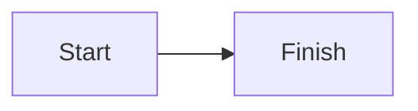

# Mintlify Components

This page renders the Mintlify compatibility surface in one place.

## Callouts

<Callout type="note">
  Generic callout content

  - First nested list item
  - Second nested list item

  ```bash
  echo "callout code block"
  ```
</Callout>

<Note>Note callout</Note>

<Warning>Warning callout</Warning>

<Info>Info callout</Info>

<Tip>Tip callout</Tip>

<Check>Check callout</Check>

<Danger>Danger callout</Danger>

## Accordions

<Accordion title="Single accordion" defaultOpen>
  Accordion body content

  <Callout>
    Nested callout inside accordion
  </Callout>

  - Accordion list item

  ```ts
  console.log('accordion code block')
  ```
</Accordion>

<AccordionGroup>
  <Accordion title="Grouped accordion A" defaultOpen>
    First grouped item
  </Accordion>
  <Accordion title="Grouped accordion B">
    Second grouped item
  </Accordion>
</AccordionGroup>

## Badges And Icons

<Badge color="blue">Beta</Badge>

<Icon icon="✨" />

## Cards And Columns

<Columns cols={2}>
  <Card title="Primary card" href="https://example.com/card-one">
    Card body text.
  </Card>
  <Column>
    <Card title="Secondary card">
      Nested in a Column.
    </Card>
  </Column>
</Columns>

## Code And Tabs

```ts
export function rootCodeBlock() {
  return 'top-level code block'
}
```

<CodeGroup>

```ts helloWorld.ts theme={null}
console.log('TypeScript example')
```

```js helloWorld.js
console.log('JavaScript example')
```

</CodeGroup>

<Tabs items={["npm", "pnpm"]}>
  <Tab title="npm">
    ```bash
    npm install holocron
    ```
  </Tab>
  <Tab title="pnpm">
    ```bash
    pnpm add holocron
    ```
  </Tab>
</Tabs>

<Tabs items={["npm", "pnpm"]}>
  <Tab title="npm">
    ```bash
    npm run docs
    ```
  </Tab>
  <Tab title="pnpm">
    ```bash
    pnpm docs
    ```
  </Tab>
</Tabs>

## Color

<Color>
  <Color.Row title="Brand colors">
    <Color.Item name="Primary" value="#0969da" />
    <Color.Item name="Accent" value="#7c3aed" />
  </Color.Row>
</Color>

## Expandables And Fields

<Expandable title="Expandable section" defaultOpen>
  Expandable content body.

  - Expandable list item

  ```json
  { "expandable": true }
  ```
</Expandable>

<ParamField path="userId" type="string" required>
  Path parameter description.
</ParamField>

<ResponseField name="status" type="string" required>
  Response field description.
</ResponseField>

## Frame And Prompt

<Frame caption="Framed preview" hint="Helper text">
  <div className="rounded-md bg-muted p-4">Frame content</div>
</Frame>

<Prompt description="Ask the assistant to explain this code">
  Explain what this code does and suggest an improvement.
</Prompt>

## Mermaid



## Panel And Examples

<Panel>
  <RequestExample>

  ```bash Request
  curl https://example.com/api
  ```

  </RequestExample>

  <ResponseExample>

  ```json Response
  { "status": "ok" }
  ```

  </ResponseExample>
</Panel>

## Steps

<Steps>
  <Step title="Install dependencies">
    Install the package first.
  </Step>
  <Step title="Run the app">
    Start the development server.
  </Step>
</Steps>

## Tiles And Tooltip

<Columns cols={2}>
  <Tile href="https://example.com/tile" title="Accordion" description="Tile description">
    <div className="rounded-md bg-muted p-4 text-center">Tile preview</div>
  </Tile>
  <Tile href="https://example.com/tile-2" title="Badge" description="Another tile">
    <div className="rounded-md bg-muted p-4 text-center">Second preview</div>
  </Tile>
</Columns>

<Tooltip tip="Tooltip explanation">Tooltip trigger text</Tooltip>

## Tree

<Tree>
  <Tree.Folder name="src" defaultOpen>
    <Tree.File name="app.tsx" />
    <Tree.Folder name="components" defaultOpen>
      <Tree.File name="button.tsx" />
    </Tree.Folder>
  </Tree.Folder>
  <Tree.File name="package.json" />
</Tree>

## Update And Views

<Update label="2026-04-07" description="v0.1.0" tags={["release"]}>
  Initial component fixture release.

  - Added nested content coverage

  ```bash
  pnpm test-e2e --project=mintlify-components
  ```
</Update>

<View title="JavaScript" icon="✨">
  JavaScript-specific content.
</View>

<View title="Python" icon="🐍">
  Python-specific content.
</View>
