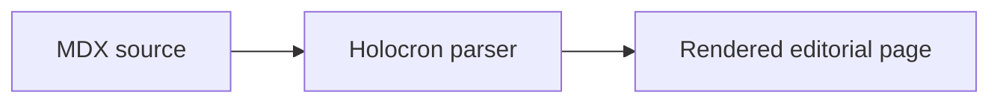
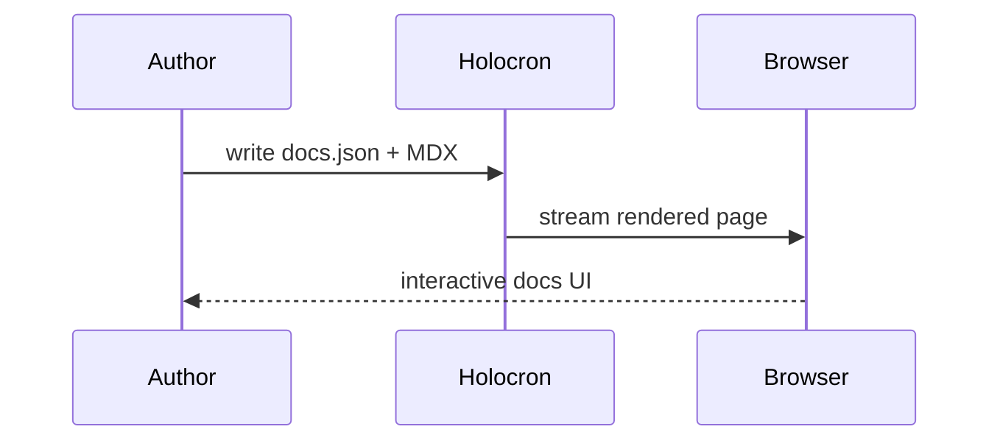

# Mermaid Diagrams

Holocron supports fenced `mermaid` blocks, which makes them easy to write in plain MDX.

## Holocron differences

- Holocron supports the core authoring flow: fenced mermaid blocks rendered inline on the page.
- Mintlify documents control placement and larger diagram ergonomics more explicitly. Those remain good parity targets if we extend the renderer later.
