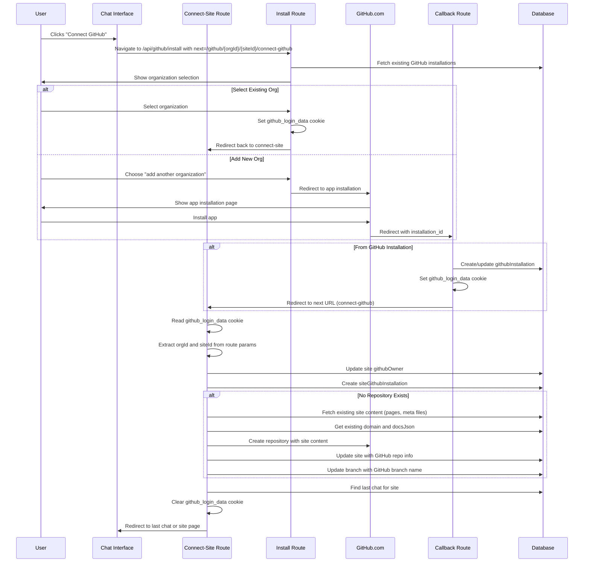

# GitHub Repository Connection Flow

This document explains the flow for connecting a GitHub repository to a Fumabase site.

## Overview

The GitHub repository connection flow allows users to:
- Connect their GitHub account to Fumabase
- Select or create a repository for their documentation site
- Automatically sync content between GitHub and Fumabase
- Preserve existing site content when creating new repositories

## Flow Steps

### 1. User Initiates Connection
- User clicks "Connect GitHub" button in the chat interface
- Button is a `Link` component that navigates to `/api/github/install` with `next` parameter set to `/github/:orgId/:siteId/connect-github`

### 2. Connect-GitHub Route Processing
- Route checks for existing `github_login_data` cookie
- If no cookie exists, returns error (user should have come from install route)
- Verifies user has access to the site
- Shows form to create repository if site is not connected

### 3. GitHub Organization Selection
- User sees list of available GitHub organizations/accounts
- Selections are fetched from existing `githubInstallation` records
- User selects an organization or chooses to add a new one
- Sets `github_login_data` cookie with selected account
- If adding new org, redirects to GitHub's app installation page

### 4. GitHub App Installation (if needed)
- User installs the GitHub app on their organization
- GitHub redirects back to `/api/github/callback` with installation details

### 5. GitHub Callback Processing
- Creates/updates `githubInstallation` record in database
- Sets `github_login_data` cookie with the account login
- Redirects to the URL specified in the `next` state parameter

### 6. Connect-GitHub Route Processing
- Reads `github_login_data` cookie and extracts `githubAccountLogin`
- Uses orgId and siteId from route parameters
- Always updates site's `githubOwner` field with the connected account
- Creates `siteGithubInstallation` connection
- If site has no repository:
  - Gets existing site content (pages, meta files) from the database
  - Uses existing domain for repository homepage URL
  - Reuses existing `docsJson` configuration from site branch
  - Creates repository with actual site content (falls back to template if empty)
  - Updates site with GitHub repo information
  - Updates existing branch with GitHub branch name
- Finds the last chat for the site
- Clears the `github_login_data` cookie
- Redirects to the last chat or site page

## Mermaid Diagram

## Cookie Usage

### `github_login_data`
- **Purpose**: Passes selected GitHub account information
- **Contents**: `{ githubAccountLogin: string }`
- **Lifetime**: 5 minutes
- **Set by**: Install route or Callback route
- **Cleared by**: Connect-github route (after processing)
- **Constant**: Exported from `api.github.webhooks.ts` as `GITHUB_LOGIN_DATA_COOKIE`

## Key Features

1. **Simplified Flow**: Removed unnecessary `github_connect_state` cookie
2. **Route Parameters**: Uses URL route parameters for orgId and siteId instead of cookies
3. **Single Cookie**: Only uses `github_login_data` cookie for GitHub account information
4. **Type Safety**: Uses TypeScript types for cookie data
5. **Auto-redirect**: Automatically navigates to the last chat after connection
6. **Repository Creation**: Automatically creates a new repository if none exists
7. **Error Handling**: Validates cookies and throws appropriate errors

## Error Cases

- Missing authentication: Returns 401 Unauthorized
- Missing cookies: Returns 400 Bad Request with descriptive message
- Site not found: Returns 404 Not Found
- GitHub API failures: Propagated as thrown errors

## Implementation Notes

- All cookies are HTTP-only for security
- Cookies use `encodeURIComponent` with JSON for complex data
- Route parameters (`orgId`, `siteId`) ensure proper scoping
- No URL parameters are used for sensitive data
- The `githubOwner` field is always updated when connecting, even for existing repos
- Repository creation uses actual site content instead of templates
- Existing domains and `docsJson` are preserved when creating repositories
- Falls back to starter template only if the site has no content